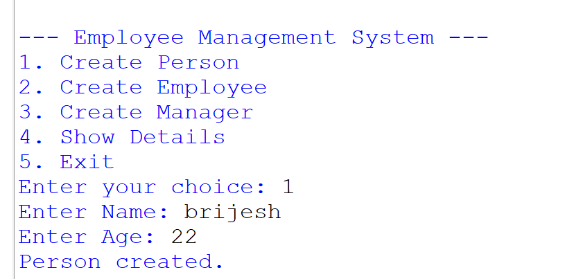
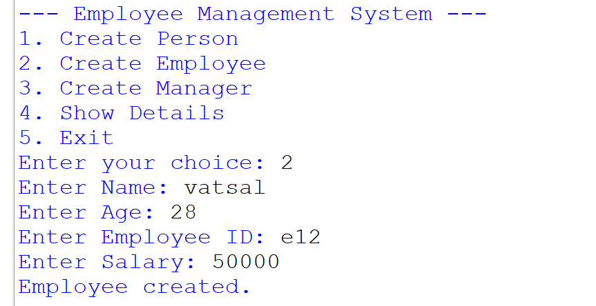
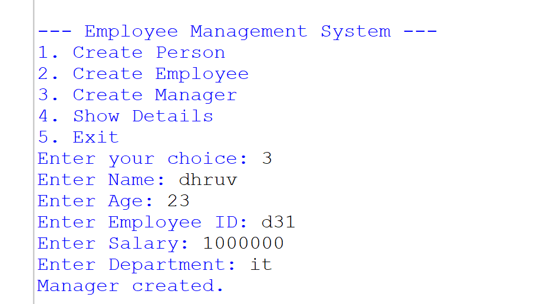
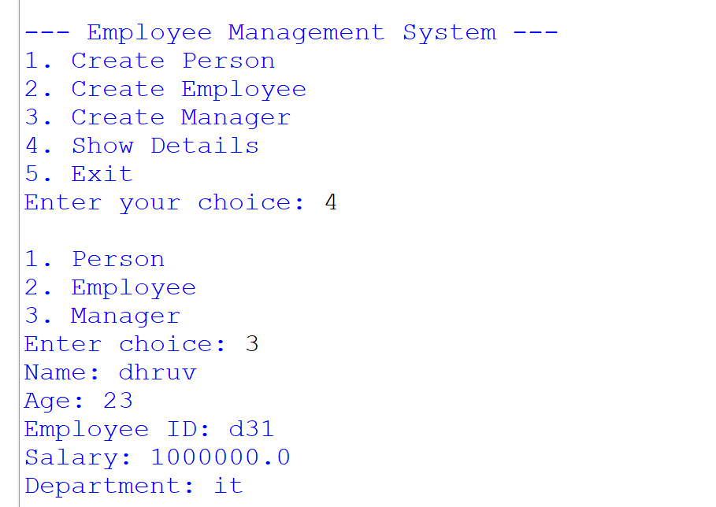

# 🧑‍💻 Employee Management System (Python OOP Project)

A simple **menu-driven Employee Management System** built using **Python and Object Oriented Programming (OOP)** concepts.

This project demonstrates important OOP concepts such as:

✨ Classes and Objects  
✨ Inheritance  
✨ Method Overriding  
✨ Constructors  
✨ Menu Driven Programs  

The system allows users to create and manage different types of employees using a simple terminal interface.

---

# 🚀 Features

✅ Create Person  
✅ Create Employee  
✅ Create Manager  
✅ Show Stored Details  
✅ Menu Driven Interface  
✅ Beginner Friendly Code  

---

# 🧠 OOP Concepts Used

### 1️⃣ Class and Object
The project uses classes like:

- `Person`
- `Employee`
- `Manager`

Objects are created based on user input.

---

### 2️⃣ Inheritance
The **Employee class inherits from Person**, and **Manager inherits from Employee**.
Person
↓
Employee
↓
Manager

This helps reuse code and organize the system better.

---

### 3️⃣ Method Overriding
The **Manager class overrides the display method** to add department details.

---

# 📂 Project Structure
Employee-Management-System
│
├── employee_management.py
├── README.md
│
└── Screenshots
├── sc1.png
├── sc2.png
├── sc3.png
└── sc4.png

---

# 🖥️ Program Menu

The system runs using a **menu based interface**.
--- Employee Management System ---

Create Person

Create Employee

Create Manager

Show Details

Exit

Users can select an option by entering the number.

---

# 📸 Program Screenshots

## 1️⃣ Creating a Person

The user enters name and age to create a person.

---

## 2️⃣ Creating an Employee

The user enters:

- Name
- Age
- Employee ID
- Salary

---

## 3️⃣ Creating a Manager

Managers have additional information like **department**.

---

## 4️⃣ Displaying Details

The program allows users to display stored data for:

- Person
- Employee
- Manager

🎯 Learning Outcome
This project helps beginners understand:

Python Classes

Object Creation

Inheritance

Method Overriding

Menu Driven Programs

User Input Handling

👨‍💻 Author
Dhruv Prajapati

